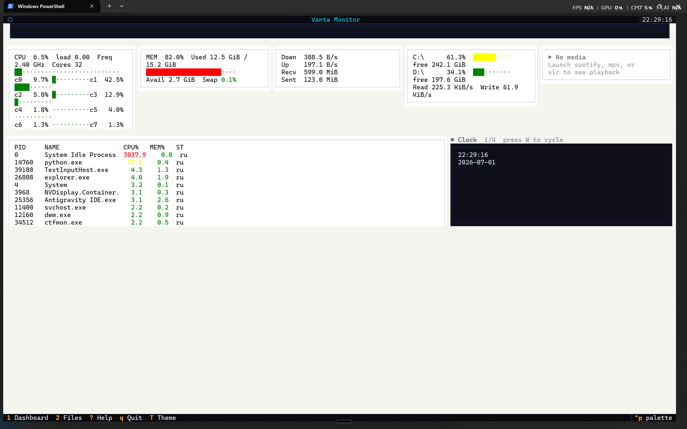

# Vanta

A **super aesthetic terminal dashboard** and **real-time system monitor** with TUI + web interfaces.

> Vanta is a modular terminal dashboard that absorbs everything into one cohesive tmux-based experience. It ships with an independent system monitor (`vanta-monitor`) powered by Textual.

## Quick start

```bash
# Interactive mode selector
cd ~/Projects/vanta
./bin/vanta.sh

# Or launch specific mode directly
./bin/vanta.sh focus     # splash + clock
./bin/vanta.sh work      # clock + calendar + yazi + lazygit
./bin/vanta.sh chill     # cava + cmatrix + quotes
./bin/vanta.sh all       # everything
./bin/vanta.sh monitor   # System monitor TUI only
```

## Vanta Monitor (standalone Python TUI)

The monitor is a self-contained Python package at `monitor/`. It runs independently from the tmux dashboard.



```bash
cd monitor
pip install -e .
vtui               # Textual TUI dashboard
vmon web           # Flask web dashboard at :5001
vmon both          # TUI + web simultaneously
```

**5 keyboard-driven screens:**

| Key | Screen  | Content |
|-----|---------|---------|
| 1   | Dashboard | Dense system monitor panels + paged extra widgets |
| 2   | Processes | Real-time process table with filter, kill/stop/resume |
| 3   | Storage   | Disk mount usage table |
| 4   | Network   | Live upload/download speed + cumulative totals |
| 5   | Graphs    | Large detailed sparklines with dual-resolution history |

**Keybinds:**

| Key | Action |
|-----|--------|
| `1-5` | Switch screens |
| `?` | Help overlay |
| `[` / `]` | Cycle dashboard widget pages |
| `k` | Kill selected process |
| `s` | Stop (suspend) selected process |
| `r` | Resume selected process / refresh screen |
| `t` | Cycle sort column |
| `Ctrl+T` | Toggle sort direction |
| `/` | Focus process filter |
| `T` | Toggle light/dark theme |
| `q` | Quit |

**Features:**
- Color-coded utilization bars (green/yellow/red thresholds)
- 2-column per-core CPU grid
- GPU utilization + VRAM bars (NVIDIA via pynvml, optional)
- Disk IO read/write rates
- Process table with color-graded CPU/MEM columns
- Light/dark theme with T-toggle across all screens
- Responsive layout: compact/tiny mode on small terminals
- Paged extra widgets from config
- Web dashboard with GSAP animations at :5001
- 70+ unit tests

## Requirements

### Core
- tmux
- Python 3.10+

### Recommended tools
- tty-clock, cal, cava, cmatrix, yazi
- fastfetch or neofetch
- lazygit
- fortune, cowsay

### Optional
- NVIDIA GPU + `pip install .[gpu]`
- bandwhich (network CLI)
- pipes.sh (aesthetic)
- ncmpcpp + mpd (music)
- kitty (image support)

## Project structure

```
vanta/
├── README.md          # This file
├── CONTRIBUTING.md    # Contributor guide
├── LICENSE            # MIT
├── .github/           # CI workflows
├── bin/               # tmux dashboard launchers
│   ├── vanta.sh       # Main launcher
│   ├── vanta-select   # Interactive mode selector
│   ├── vanta-toggle   # Module toggle script
│   └── vanta-mode     # Mode switcher
├── config/            # tmux theme & config
├── docs/              # Architecture, progress, production checklist
└── monitor/           # Built-in system monitor (Python)
    ├── README.md      # Monitor-specific docs
    ├── ARCHITECTURE.md
    ├── pyproject.toml
    ├── config.json
    ├── tests/
    └── src/monitor/
        ├── __main__.py       # CLI entry points
        ├── app.py            # Textual app (5 screens)
        ├── server.py         # Flask dashboard + API
        ├── core/             # Collector, models, presenters
        ├── screens/          # TUI screen widgets
        └── components/       # Reusable widgets
```

## Toggleable modules

| Module | Description | Toggle |
|--------|-------------|--------|
| Monitor | System monitor TUI (Textual) | `Ctrl+g` |
| btop/jtop | System monitor | `Ctrl+b` |
| tty-clock | Large font clock | `Ctrl+k` |
| cal | Compact calendar | `Ctrl+c` |
| cava | Music visualizer | `Ctrl+v` |
| cmatrix | Matrix rain | `Ctrl+m` |
| yazi | File manager | `Ctrl+f` |
| custom text | Quotes, status, info | `Ctrl+t` |
| wallpaper | Static image (kitty) | `Ctrl+w` |
| sysinfo | System info | `Ctrl+i` |
| network | Bandwidth monitor | `Ctrl+n` |

## License

MIT — Copyright (c) 2026 Noel Paul
