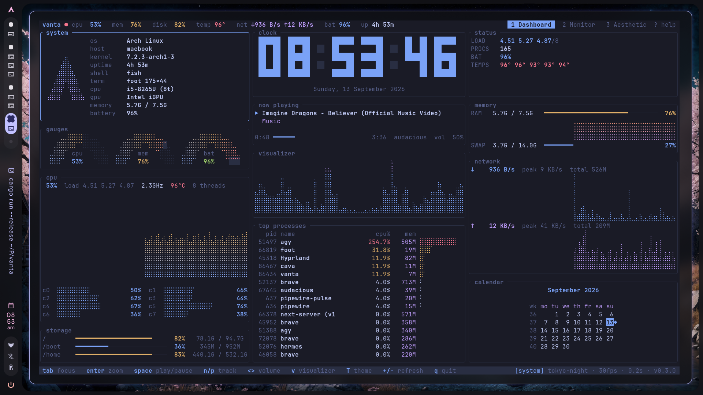
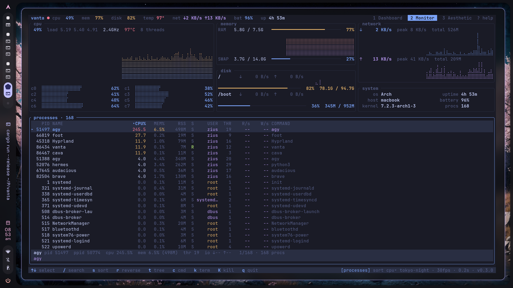
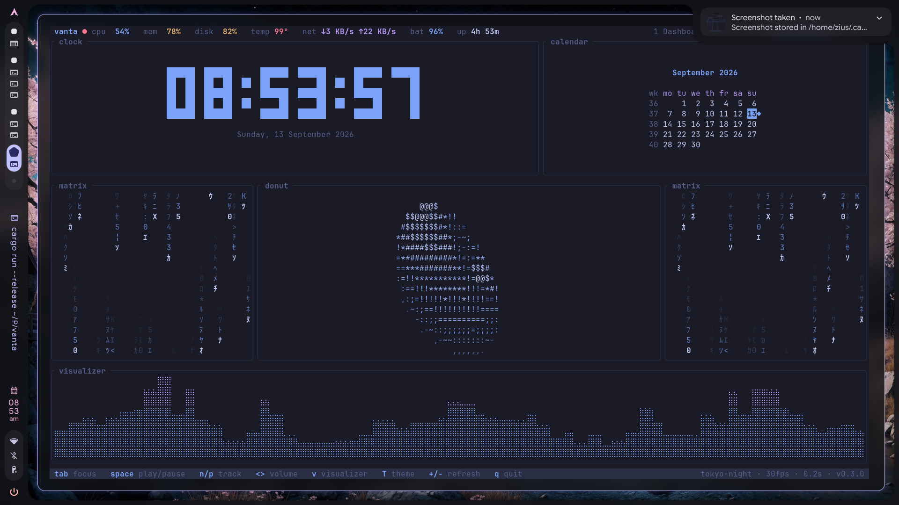
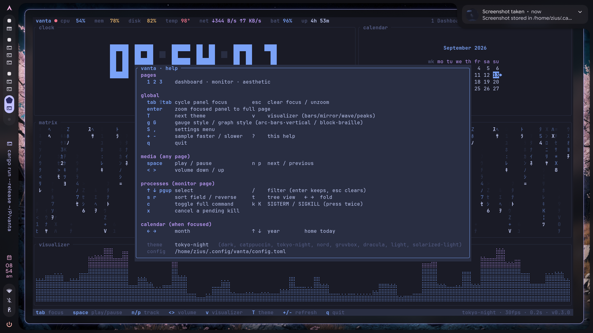

<div align="center">

# vanta

**Your machine, one pane.**

A fast, aesthetic terminal system dashboard in Rust.

[](https://www.npmjs.com/package/@ziuus/vanta)
[](https://github.com/ziuus/vanta/actions/workflows/ci.yml)
[](https://github.com/ziuus/vanta/releases)
[](LICENSE)
[](https://website-pi-seven-nty4ogjp2f.vercel.app)

<br />



</div>

---

Vanta collapses everything you care about into one terminal pane: CPU, memory, disk,
network, GPU, processes, now-playing, a block-digit clock, a calendar, and an audio
visualizer. Keyboard only. **~3 MB binary, ~2–5% CPU** at the default 30 fps.

```bash
npm install -g @ziuus/vanta && vanta
```

## Install

<table>
<tr><th align="left">Method</th><th align="left">Command</th><th align="left">Notes</th></tr>
<tr>
  <td><strong>npm</strong></td>
  <td><code>npm install -g @ziuus/vanta</code></td>
  <td>Fetches the prebuilt <code>linux-x64</code> binary. No Rust needed.</td>
</tr>
<tr>
  <td><strong>Prebuilt binary</strong></td>
  <td><a href="https://github.com/ziuus/vanta/releases/latest">Releases</a></td>
  <td>Download the <code>tar.gz</code>, drop <code>vanta</code> on your <code>PATH</code>.</td>
</tr>
<tr>
  <td><strong>cargo</strong></td>
  <td><code>cargo install --git https://github.com/ziuus/vanta</code></td>
  <td>Any architecture. Needs a Rust toolchain.</td>
</tr>
<tr>
  <td><strong>From source</strong></td>
  <td><code>git clone https://github.com/ziuus/vanta &amp;&amp; cd vanta &amp;&amp; cargo run --release</code></td>
  <td>For hacking on it.</td>
</tr>
</table>

**One-liner, no install:**

```bash
npx @ziuus/vanta
```

The npm install puts down two commands for the same binary — `vanta` and the
shorter `vtui`. A `cargo install` gives you `vanta` only.

### Requirements

Linux (vanta reads `/proc` and `/sys`). Building from source also needs `libdbus`:

```bash
sudo pacman -S dbus              # Arch
sudo apt install libdbus-1-dev   # Debian / Ubuntu
sudo dnf install dbus-devel      # Fedora
```

Optional tools that light up extra panels — vanta degrades quietly without them:

| Tool | Unlocks |
|------|---------|
| `cava` | Audio visualizer (falls back to an idle wave) |
| `nmcli` | Wi-Fi SSID + signal strength |
| `nvidia-smi` | NVIDIA GPU utilisation, VRAM, temp |
| `docker` | Running-container count |
| `checkupdates` | Pending Arch package updates |

## Managing vanta

```bash
vanta --version                 # what am I running
vanta --help                    # usage + keys

npm update -g @ziuus/vanta      # update  (npm)
npm uninstall -g @ziuus/vanta   # remove  (npm)

cargo install --git https://github.com/ziuus/vanta --force   # update  (cargo)
cargo uninstall vanta                                        # remove  (cargo)

rm -rf ~/.config/vanta          # drop config + persisted theme/page
```

Where things live:

| Path | What |
|------|------|
| `~/.config/vanta/config.toml` | Config, plus the theme / page / visualizer vanta persists for you |
| `$(npm root -g)/@ziuus/vanta/bin/` | The npm-installed binary |
| `~/.cargo/bin/vanta` | The cargo-installed binary |

Vanta respects `XDG_CONFIG_HOME` if you set it.

## Pages

| Key | Page | What's on it |
|-----|------|--------------|
| `1` | **Dashboard** | System facts + distro logo, semicircle gauges, CPU graph & cores, storage, big clock, now playing, visualizer, top processes, status, memory, network, calendar |
| `2` | **Monitor** | btop-style: CPU / memory / disk I/O / network / GPU graphs on top, full process table below (sort, filter, tree, kill) |
| `3` | **Aesthetic** | Huge clock, calendar, matrix rain, spinning donut, full-width visualizer |
| `?` | **Help** | Keybind reference overlay |

### `2` — Monitor

Every graph on top, every process below. Sort it, filter it, tree it, kill it.



### `3` — Aesthetic

For when the build is running and you want something to look at.



### `?` — Help

Every key, on screen, on any page.



## Keys

| Key | Action |
|-----|--------|
| `1` `2` `3` | Switch page (persisted as startup page) |
| `Tab` / `Shift-Tab` | Cycle panel focus · `Esc` clears |
| `Enter` | Zoom the focused panel to the full page · `Esc` back |
| `T` | Next theme (persisted) |
| `v` | Visualizer style: bars / mirror / wave / peaks |
| `+` / `-` | Sample faster / slower |
| `Space` `n` `p` | Play/pause · next · previous (MPRIS, any page) |
| `<` `>` | Volume down / up |
| `?` | Help overlay |
| `q` | Quit |

**Processes (Monitor):** `↑↓ PgUp PgDn Home End` select · `/` filter (`Enter` keeps, `Esc` clears) · `s` sort field · `r` reverse · `t` tree · `←→` fold · `c` full command · `k` SIGTERM · `K` SIGKILL (press twice to confirm, `x` cancels)

**Calendar (focused):** `←→` month · `↑↓` year · `Home` today

## Themes

`dark` · `catppuccin` · `tokyo-night` · `nord` · `gruvbox` · `dracula` · `light` · `solarized-light`

Cycle with `T` — your choice is written back to the config file.

## Configuration

`~/.config/vanta/config.toml`. Every key is optional; delete the file to reset.

```toml
[ui]
refresh_rate = 0.5      # seconds between samples
fps = 30                # render rate (animations)
theme = "dark"
startup_mode = "dashboard"
clock_24h = true
visualizer = "bars"     # bars | mirror | wave | peaks

[widgets]               # all default to true
cpu = true
memory = true
disk = true
network = true
gpu = true
clock = true
calendar = true
music_viz = true
processes = true
media = true
matrix = true
video = true
```

## Architecture

All telemetry is collected on a single background sampler thread (`/proc`, `/sys`,
sysinfo, D-Bus) into lock-guarded snapshots; the render loop only reads snapshots
and never blocks on I/O.

| Layer | Technology |
|-------|------------|
| TUI | Ratatui 0.29 + Crossterm |
| Telemetry | `sysinfo`, `/proc`, `/sys/class/{hwmon,drm,power_supply}` |
| GPU | NVIDIA (`nvidia-smi`), AMD (sysfs), Intel (clock only) |
| Media | MPRIS over D-Bus (`dbus` crate) |
| Audio viz | `cava` raw output, idle wave fallback |

## Contributing

Issues and PRs welcome — bug reports, new themes, new panels, or a GPU vendor
that isn't covered yet.

```bash
git clone https://github.com/ziuus/vanta && cd vanta
cargo run --release

# CI runs exactly this — make it pass first
cargo fmt --all -- --check
cargo clippy --all-targets -- -D warnings
cargo test
```

Read **[CONTRIBUTING.md](CONTRIBUTING.md)** first — it covers how the code is laid
out, the sampler-thread rule (*never do I/O inside a `render()`*), the panel
degradation contract, and how to add a theme.

Good first contributions:

- A new theme in `src/theme.rs` (add a constructor + its name to `THEME_NAMES`)
- Per-interface network stats
- NVMe / extra `hwmon` temperature sources
- Mouse click-to-focus

## License

[MIT](LICENSE) — do what you like, keep the notice.

<div align="center">
<br />
built by <a href="https://github.com/ziuus">zius</a> · if it's useful, a ⭐ helps
</div>
