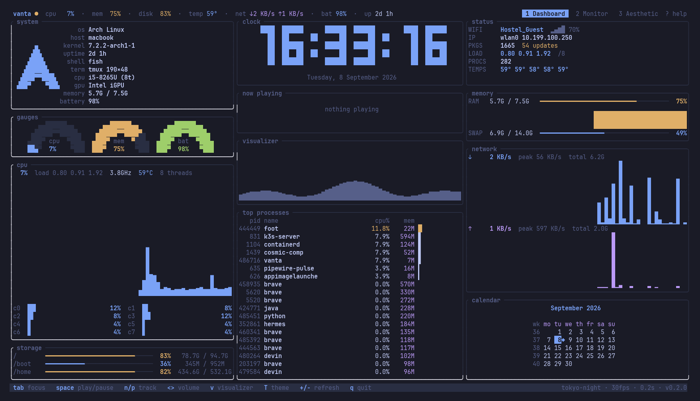

<div align="center">
  <br />
  <h1>vanta</h1>
  <p>
    <strong>Your machine, one pane.</strong><br/>
    A blazingly fast, highly aesthetic terminal system dashboard built in Rust.
  </p>
  <a href="https://website-pi-seven-nty4ogjp2f.vercel.app">
    
  </a>
  <a href="https://github.com/ziuus/vanta/releases">
    
  </a>
  <a href="https://crates.io/crates/vanta">
    
  </a>
  <br /><br />
  
</div>

<hr />

## 🚀 The Ultimate Terminal Cockpit

**Vanta** collapses all the system metrics you care about into a single, beautiful terminal pane. It's fully keyboard-driven with zero mouse dependency and no floating tabs.

With six dedicated dashboard modes, Vanta transforms from a dense technical monitor to pure terminal eye-candy with a single keystroke.

## ⚡ Core Modes

| Key | Mode | Description |
|-----|------|-------------|
| `1` | **Overview** | Full monitoring grid: CPU, Memory, Disk, Network, GPU, Clock, Calendar, Media Player, System Info, and Live Processes. |
| `2` | **Monitor** | Focused hardware metrics layout for quick glance-and-go health checks. |
| `3` | **Processes** | Full-width process table with sort, search, tree-view, collapse, and immediate kill signals. |
| `4` | **Media** | Large music visualizer + MPRIS player controls + prominent clock. |
| `5` | **Aesthetic** | Pure eye candy: Matrix Rain, Calendar, Visualizer, Clock, and a rotating 3D donut demo. |
| `6` | **Settings** | Configuration help, active theme selection, and full keyboard reference. |

---

## 🎹 Keyboard Mastery

No mouse. No touch. Just keys.

### Global Actions
| Key | Action |
|-----|--------|
| `1`–`6` | Switch dashboard modes |
| `T` | Cycle themes (changes persist to config) |
| `Tab` / `Shift‑Tab` | Cycle panel focus |
| `↑` `↓` `←` `→` | Navigate the active panel |
| `Esc` | Clear panel focus |
| `q` | Quit |

### Process Explorer (`Mode 3`)
| Key | Action |
|-----|--------|
| `s` | Cycle sort fields (PID, CPU, Mem, Name, RSS) |
| `/` | Enter search mode |
| `t` | Toggle tree view |
| `←` `→` | Collapse / Expand tree node |
| `i` | View process details |
| `c` | Toggle compact command view |
| `k` | Send Kill signal (SIGTERM) |

### Media Player (`Mode 4`)
| Key | Action |
|-----|--------|
| `Space` | Play / Pause |
| `n` / `p` | Next / Previous track |
| `+` / `-` | Volume Up / Down |

---

## 🎨 Professional Themes

Cycle through four meticulously designed color palettes using `T`:

1. **Dark** (Default) — Deep, immersive terminal blacks.
2. **Light** — High-contrast, clean paper white.
3. **Dracula** — Classic purple-accented dark theme.
4. **Solarized Light** — Warm, easy-on-the-eyes daylight theme.

Your selection is automatically persisted to `~/.config/vanta/config.toml`.

---

## ⚙️ Configuration

Vanta is fully modular. Configure widgets, refresh rates, and your default theme via `~/.config/vanta/config.toml`:

```toml
[ui]
refresh_rate = 0.5
theme = "dark"
# Optional: render any image as ASCII art in the profile widget.
# Leave unset to use the built-in vanta logo. Supports ~ expansion.
image_path = "~/Pictures/avatar.png"

[widgets]
cpu = true
memory = true
disk = true
network = true
gpu = true
clock = true
calendar = true
music_viz = true
processes = true
media = true
cmatrix = true
```

---

## 📥 Installation

You will need the Rust toolchain installed.

**From Cargo:**
```bash
cargo install --git https://github.com/ziuus/vanta
```

**From Source:**
```bash
git clone https://github.com/ziuus/vanta.git
cd vanta
cargo run --release            # Live hardware monitoring
```

---

## 🏗️ Architecture

| Layer | Technology |
|-------|------------|
| **Core Framework** | Rust + Ratatui `0.29` |
| **Terminal IO** | Crossterm |
| **Telemetry** | `sysinfo`, `/proc`, `/sys` (NVIDIA/AMD/Intel GPU) |
| **Media Sync** | MPRIS (DBus / `playerctl`) |
| **Audio Viz** | `cava` + PulseAudio |
| **Time** | `chrono` |

---

<div align="center">
  <p>Built with 🖤 by <a href="https://github.com/ziuus">zius</a></p>
  <p>Released under the MIT License.</p>
</div>